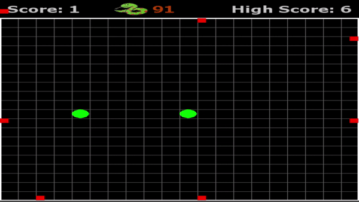

# artificial-intelligence-snake
AI is trained to play the game of snake using a shallow neural net (2 hidden layers) and reinforcement learning.

What are the red and white squares? (click to show)

 

The snake receives 14 input parameters:
<ul>
  2 for the snake head's normalized x and y distance from the food 
  4 denoting if the food is above, below, to the left or to the right of the head 
  8 noting the nearest obstruction in the &plusmn;x, &plusmn;y, &plusmn;45&deg;, &plusmn;135&deg; directions 
  4 denoting if the snake is headed right, up, left or down 
</ul>
The red and white squares are placed at the 8 obstructions that the snake sees in the third bullet point.  The square is white if the obstruction is the snake's body and red if the obstruction is the wall.  This means that the snake typically does not know where the majority of it's tail is.

What is the count down?

 
The count down is for the snakes energy.  Every space that the snake moves costs the snake one unit of energy and everytime the snake eats food it gains 100 units of energy and grows one unit longer.  When the snake is low on energy (less than 200) the meter gradually turns from green to dark red.

### Generation 1 versus Generation 343

### Can you defeat AI snake?

Try the playing JavaScript version here:  

https://lprowe.github.io/lpr-website/projects/ai-snake-playable/index.html 

Please excuse my JavaScript, converting this project from python to JavaScript was my first experience with the language.

## Learning Timelapse:

<b>Click on the generation name to show / hide progress.</b> 
Each generation shows the best preforming neural net of 500 snakes from that generation.

<b>Generation 1</b>: likes to run into the wall

<b>Generation 5</b>: learns that cycles prolong it's life

<b>Generation 20</b>: getting food has a larger reward than a long life, starts to go towards food

<b>Generation 76</b>: ... not much progress since gen 20

<b>Generation 85</b>: <b>First signs of a real strategy!</b> Loops towards food.

<b>Generation 91</b>

<b>Generation 131</b>

<b>Generation 171</b>: <b>A cyclic strategy that avoids walls and targets food emerges!</b>

<b>Generation 231</b>

<b>Generation 271</b>: Hug the wall strategy. Only leaves for food.

<b>Generation 300</b>

<b>Generation 318</b>

<b>Generation 343</b>: Balances survival and desire for food by prioritizing obstacle avoidance when a direct path to the food would result in game over and prioritizing food when there is a clear path.

## History

A fitness function, described below was used to judge how well each of the 500 snakes in each generation performed.  The best performing snake's score from each generation is shown in the red line.  While the average fitness score of a generation is shown as the blue line.  The green lines show &plusmn; 1 standard deviation from the average.   

Notice at generations 160 and 290 there are sharp drops in the average fitness score.  At these points the average model's fitness score appeared to be improving at an asymptotic rate.  So the mutation rate was increased to somewhere between 0.05 and 0.1 for a few generations in an effort to shake up the models.  After which the mutation rate was decreased to between 0.01 and 0.03.  This "shaking up" resulted in short but signifcant periods of rapid improvement. 

## Overview

The objective of snake is to eat as much food as possible without dying. 
The snake dies if it bites its tail or if it goes out of bounds. 
Every time the snake finds food, it grows in length by 1. 
Here a new factor is imposed, hunger. 
The snake must find food within <b>food_energy</b> steps or else it will starve. 
Every time the snake eats food it gains <b>food_energy</b> steps up to a cap of 999.

## Usage

<b>ga_snake_playback.py</b> (click to show)

 
Loads the last N trained models. 
Plays snake using the trained model as shown in the above GIFs. 
<b>left-arrow key:</b> snake uses the model from the previous generation 
<b>right-arrow key:</b> snake uses the model from the next generation 
<b>up-arrow key:</b> speeds the game up 
<b>down-arrow key:</b> slows the game down 

<b>ga_snake_train.py</b> (click to show)

 

Runs a population of 500 snakes per generation.  Each snake will be scored based on how many steps it took and how much food it found.  The top <b>survival_fraction</b> (10%) of snakes are allowed to breed.  Breeding means their neural network weights will be crossed with other snakes from the pool to create the next generation of snakes. 

The nerural network weights for the entire last generation of snakes is always saved in "./ga_snake_history/checkpoint_weights" so that the training can be stopped after a given generation and resumed with a different settings if desired. 

## Settings

<b>settings_playback.py</b> (click to show)

 
<b>grid_size:</b> controls the columns and rows in the grid 
<b>food_energy:</b> energy gained by the snake for finding food 
<b>nn_shape:</b> [number_of_input_nodes, *hidden_layer_nodes, number_of_output_nodes] 
<b>activation_functions:</b> activation functions used for neural net hidden and output layers 
<b>watch:</b> True will display the game, False will hide the game 
<b>autoplay:</b> True will cycle through all loaded generations automatically 
<b>clock_speed:</b> Initial ms delay between frames can be changed in game with up/down keys 
<b>colorful:</b> If True snake will take the color of its rainbow food 
<b>play_top_n_gen:</b> How many generations to load (0 will load all generations) 
<b>basic_instincts:</b> Hardcoded rules imposed on top of neural net (looks 1 step ahead) 

<b>settings_training.py</b> (click to show)

 
<b>grid_size:</b> controls the columns and rows in the grid 
<b>food_energy:</b> energy gained by the snake for finding food 
<b>population:</b> number of snakes per generation 
<b>generations:</b> how many generations to run for before stopping 
<b>fitness_threshold:</b> if any snake receives this score stop running 
<b>mutation_rate:</b> Probability of any given gene being mutated 
<b>mutation_type:</b> gaussian adds value from gaussian dist. to mutated weights while uniform replaces mutated weights with a random value from a uniform dist. 
<b>mutation_range:</b> range of unifrom dist. values 
<b>survival_fraction:</b> the top survival_fraction of snakes will survive and be used to breed the next generation 
<b>nn_shape:</b> [number_of_input_nodes, *hidden_layer_nodes, number_of_output_nodes] 
<b>activation_functions:</b> activation functions used for neural net hidden and output layers 
<b>initial_config:</b> If True, continues training from last save point. Otherwise starts over from gen 1.
<b>watch:</b> True will display the game, False will hide the game 

## Try it yourself.

If you do not already have TensorFlow installed, you can play against the ai-snake here:

