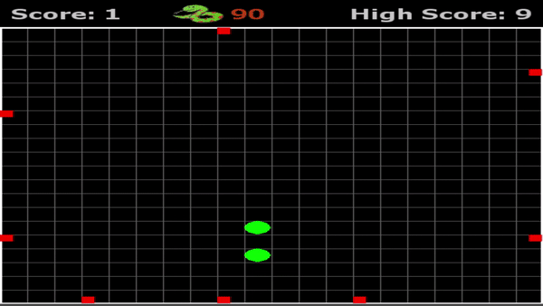

# artificial-intelligence-snake
AI is trained to play the game of snake using a shallow neural net and reinforcement learning.

### Generation 1 vs Generation 343

### Timelapse of Progress:

Click on the generation name to show / hide progress. 
Each generation is showing the best preforming neural net of 500 snakes from that generation.

Generation 1: likes to run into the wall

Generation 5: learns that cycles prolong it's life

Generation 20: getting food has a larger reward than a long life, starts to go towards food

Generation 76: ... not much progress since gen 20

Generation 85: <b>First signs of a real strategy!</b> Loops towards food.

Generation 91

Generation 131

Generation 171: <b>A cyclic strategy that avoids walls and targets food emerges!</b>

Generation 231

Generation 271: Hug the wall strategy. Only leaves for food.

Generation 300

Generation 318

Generation 343: Balances survival and desire for food by prioritizing obstacle avoidance when a direct path to the food would result in game over and prioritizing food when there is a clear path.

